# Diagrama de Flujo — Pipeline de Detección de Stock

Muestra el **pipeline end-to-end por frame**, incluyendo qué módulo
del repositorio corresponde a cada etapa, qué latencia se espera y
qué configuración externa (archivos YAML) alimenta a cada bloque.

```mermaid
flowchart LR
    %% ============ ENTRADA ============
    A([Fuente de frames]):::in
    A -- img --> AI(cámara IP/webcam/archivo de video)
    A -- imgs --> AF(carpeta de imágenes estáticas)

    %% ============ PREPROCESAMIENTO ============
    subgraph PRE [📦 Preprocesamiento — src/preprocessing]
      direction TB
      P1[Denoise<br/>fastNlMeans / gaussian / bilateral]
      P2[CLAHE<br/>Contraste local adaptativo]
      P3[Corrección Gamma opcional<br/>O = c * I^γ]
      P4[Sharpen suave<br/>compensa pérdida nitidez]
      P1 --> P2 --> P3 --> P4
    end

    %% ============ CONFIG ============
    CFG[🔧 configs/cameras.yaml]:::cfg
    CFG -- params denoise / clahe / gamma --> PRE
    CFG -- ROI x cámara --> R

    %% ============ ROI ============
    subgraph ROI [📦 ROI — src/preprocessing/roi_handler.py]
      R[ROIs por cámara<br/>rectángulo / polígono<br/>coords normalizadas 0-1]
      RM[Máscara en píxeles<br/>del polígono ROI]
      R --> RM
    end

    %% ============ DETECCIÓN ============
    subgraph DET [📦 Detección — src/detection]
      direction TB
      Y[YOLOv8 predict<br/>modelo best.pt entrenado]
      PARS[Parsear detecciones<br/>xyxy + clase + conf]
      OCUP[% Ocupación por ROI<br/>area productos ∩ ROI / area ROI]
      VAC[% Vacío = 1 - % Ocupado]
      Y --> PARS --> OCUP --> VAC
    end

    CFG_DATA[🔧 configs/dataset.yaml]:::cfg
    CFG_DATA -- clases 0=vacio 1=producto --> Y

    %% ============ ALARMA ============
    subgraph ALR [📦 Alertas — src/alerts]
      direction TB
      TH[Umbrales desde YAML<br/>% vacío mínimo<br/>tiempo sostenido]
      SUS[Sostenimiento temporal<br/>>= N segundos]
      AM[AlertManager<br/>cooldown + flanco]
      TH --> SUS --> AM
    end
    CFG -- umbral + tiempo --> TH

    %% ============ SALIDAS ============
    subgraph OUT [📡 Salidas]
      direction TB
      S1[📄 CSV data/alerts.log]
      S2[💻 Consola<br/>WARNING]
      S3[🔌 Callback extensible<br/>Telegram / email / webhook]
      S4[🖥️ Ventana OpenCV<br/>ROI rojo + panel OK]
    end

    %% ============ LATENCIA ============
    subgraph LAT [⏱️ SLA de Latencia]
      direction TB
      L1[Ideal < 1.0 s]
      L2[Máxima < 5.0 s]
      L3[Render UI NO cuenta en el SLA]
    end

    %% ============ FLUJO PRINCIPAL ============
    AI --> PRE
    AF --> PRE
    PRE --> DET
    DET --> VAC
    VAC --> ALR
    RM --> OCUP
    ALR --> OUT

    classDef in fill:#dbeafe,stroke:#1e40af,color:#0c1220
    classDef cfg fill:#fef3c7,stroke:#b45309,color:#3b2f00
```



---

## Detalle por etapa + archivos que la implementan

| Paso | Descripción | Archivo(s) | Latencia esperada |
|------|-------------|------------|-------------------|
| Fuente | Pull de frame (USB/IP/Video/Imagen) | `cv2.VideoCapture` en `src/detection/detect.py:212-247` | variable (IO) |
| Preproc | denoise + CLAHE + gamma (opc) + sharpen | `src/preprocessing/image_enhancer.py` | 20-200 ms seg tamaño |
| ROIs | Máscara por cámara (coordenadas normalizadas) | `src/preprocessing/roi_handler.py` | < 5 ms |
| YOLO predict | Inferencia sobre frame preprocesado | `src/detection/detect.py:261-265` usando `src/detection/train.py` | 80-400 ms CPU / 10-80 ms GPU |
| % Ocupación / Vacío | Unión de bboxes ∩ ROI / área ROI | `src/detection/detect.py:89-118` (`calcular_ocupacion`) | < 2 ms |
| Criterio alarma | Umbral + sostenimiento temporal | `src/detection/detect.py:296-317` | 0 ms |
| AlertManager | Cooldown 60 s, persistencia CSV, callback | `src/alerts/alert_manager.py` | < 2 ms |

---

## Configuración externa que modifica el pipeline

### `configs/cameras.yaml`
- `cameras.<id>.rois` → forma y ubicación de cada repisa por cámara
- `preprocesamiento.denoise` / `clahe` / `gamma` → parámetros de preproc
- `alarma.porcentaje_vacio_minimo` → % vacío a partir del cual considerar alerta
- `alarma.tiempo_sostenido_seg` → segundos que debe mantenerse la condición
- `alarma.latencia_*_seg` → objetivos SLA

### `configs/dataset.yaml`
- `train`, `val`, `nc`, `names` → dataset YOLO y clases (0=vacío, 1=producto)

### `models/runs/<run>/weights/best.pt`
- Pesos del modelo entrenado por `src/detection/train.py`

---

## Garantías de reproducibilidad (kickoff: "Resultados replicables")

1. **Split train/val**: seed 42 en `src/utils/convert_dataset.py:29`
2. **Entrenamiento**: seed 42 + `deterministic=True` en `src/detection/train.py:61-76`
3. **Configuración versionada**: todo lo que cambia resultados está en YAML
4. **Argumentos por run**: YOLO escribe `args.yaml` en cada run (ej: `models/runs/stock_detector_v1/args.yaml`)

---

## Cómo extender sin tocar el pipeline core

Agregar un canal nuevo de alerta (ej: Telegram) **sin modificar `detect.py`**:

```python
from alerts.alert_manager import AlertManager

def enviar_telegram(evento):
    # tu lógica con python-telegram-bot / requests a Bot API
    print(f"[Telegram] {evento.mensaje}")

AlertManager(
    log_path="data/alerts.log",
    extra_callback=enviar_telegram,  # <-- único cambio
)
```
